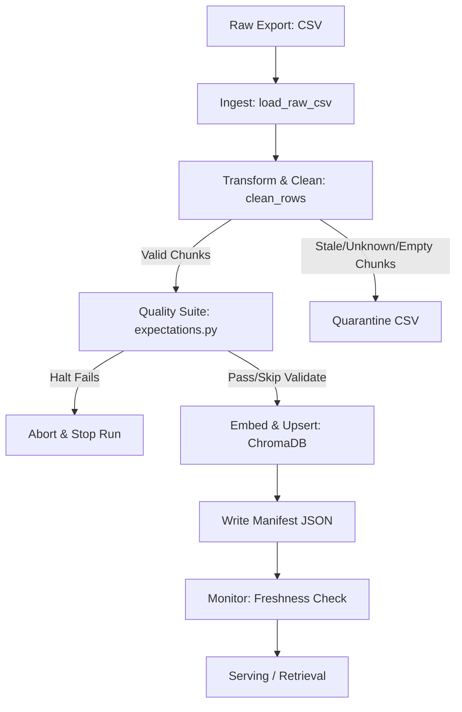

# Kiến trúc pipeline — Lab Day 10

**Nhóm:** Nhóm 10  
**Cập nhật:** 2026-06-10

---

## 1. Sơ đồ luồng (Diagram)

### Điểm đo Freshness và Metadata
- **Freshness**: Được đo ở bước **publish** (sau khi ghi manifest), so sánh trường `latest_exported_at` (ngày xuất bản của dữ liệu) với thời gian chạy hiện tại (`now`) để xác định xem dữ liệu có lỗi thời so với SLA (24 giờ) hay không.
- **Run ID**: Mỗi lượt chạy sinh ra một `run_id` duy nhất dạng timestamp (ví dụ: `2026-06-10T07-25Z`). `run_id` này được ghi nhận trong manifest, metadata của các vector trong ChromaDB và tên file CSV đầu ra.
- **Quarantine**: Các record lỗi được lưu trữ tại `artifacts/quarantine/quarantine_<run_id>.csv` kèm theo lý do cụ thể (`reason`) để điều tra sau.

---

## 2. Ranh giới trách nhiệm

| Thành phần | Input | Output | Owner nhóm |
|------------|-------|--------|--------------|
| **Ingest** | `data/raw/policy_export_dirty.csv` | List[Dict[str, str]] | Nguyễn Đình Tiến Mạnh |
| **Transform** | Raw rows, Cleaning Rules | `cleaned` & `quarantine` lists | Nguyễn Đình Tiến Mạnh |
| **Quality** | `cleaned` list | Expectation results, Halt flag | Nguyễn Đình Tiến Mạnh |
| **Embed** | `cleaned` list | ChromaDB collection `day10_kb` | Nguyễn Đình Tiến Mạnh |
| **Monitor** | `manifest_<run_id>.json` | Freshness status (PASS/WARN/FAIL) | Nguyễn Đình Tiến Mạnh |

---

## 3. Idempotency & rerun

- **Chiến lược**: Pipeline sử dụng phương thức `upsert` của ChromaDB theo `chunk_id` ổn định.
- **Tính toán ID**: `chunk_id` được sinh dựa trên hàm băm SHA-256 từ nội dung: `doc_id|chunk_text|seq` nhằm đảm bảo ID không đổi nếu nội dung không đổi.
- **Rerun**: Khi chạy lại pipeline nhiều lần, các vector trùng `chunk_id` sẽ được cập nhật đè (upsert) chứ không sinh thêm vector mới, tránh trùng lặp dữ liệu trong collection.
- **Pruning**: Tại mỗi run, pipeline sẽ lấy danh sách ID cũ và so sánh với danh sách ID mới. Bất kỳ ID nào không còn xuất hiện trong tập cleaned mới sẽ bị xóa khỏi ChromaDB (`col.delete`), đảm bảo cơ sở dữ liệu chỉ phản ánh snapshot sạch nhất của lần chạy gần nhất.

---

## 4. Liên hệ Day 09

- Pipeline này đóng vai trò cung cấp corpus sạch dạng vector database lưu trong `day10_kb` cho Retrieval module ở Day 09.
- Collection `day10_kb` được lưu tại `./chroma_db` (hoặc cấu hình thông qua biến môi trường `CHROMA_DB_PATH`). Thay vì đọc trực tiếp file văn bản raw thô sơ ở Day 09, các agent ở Day 09 có thể kết nối trực tiếp đến ChromaDB này để thực hiện truy vấn ngữ nghĩa (Semantic Search) với chất lượng dữ liệu được đảm bảo cao nhất.

---

## 5. Rủi ro đã biết

- **Trôi lệch SLA Freshness**: Nếu hệ thống CRM/ERP nguồn không xuất dữ liệu mới định kỳ, hoặc định dạng `exported_at` bị sai, hệ thống cảnh báo Freshness sẽ báo động đỏ (FAIL).
- **Phụ thuộc mô hình nhúng**: Nếu đổi mô hình nhúng ở `.env` (ví dụ sang OpenAI hoặc mô hình multilingual khác) mà không xóa DB cũ, các vector cũ sẽ bị trộn lẫn với vector mới có số chiều khác, gây lỗi truy vấn. Khắc phục: luôn dọn dẹp `./chroma_db` khi đổi cấu hình.
